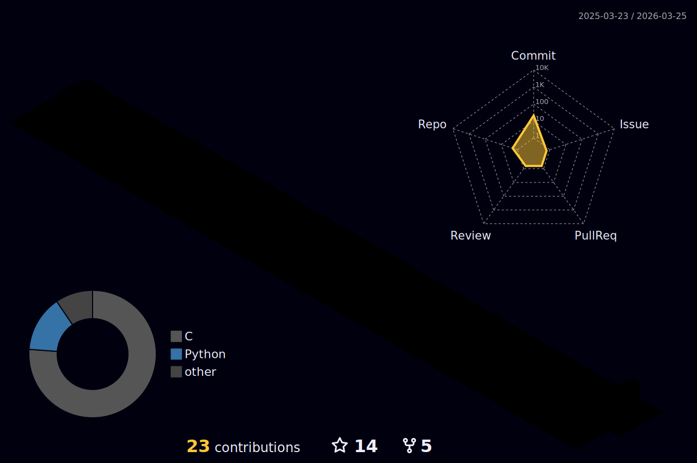

<!-- Cyberpunk cafe Pixel art: https://media.giphy.com/media/pVGsAWjzvXcZW4ZBTE/giphy.gif -->
<!-- Ramen stall pixel art: https://media.giphy.com/media/ckr4W2ppxPBeIF8dx4/giphy.gif -->
<!-- Cyberpunk city pixel art: https://media.giphy.com/media/NKEt9elQ5cR68/giphy.gif -->
<!-- Cowboy bebob: https://media.giphy.com/media/4ilFRqgbzbx4c/giphy.gif -->
<!-- Tales of arise fight scene: https://media.giphy.com/media/6ULDGyRw0uhECEhAaQ/giphy-downsized-large.gif -->

# 👋 Hello, I'm Conrad
- [42Heilbronn](https://www.42heilbronn.de/en/) Alumni (Part of the [42Network](https://www.42network.org/))
- Programmer
- Gamer
- Watching Anime
- Always trying to learn something new

# 📊 Github Stats
<!--  -->
<h4 align="center">Isometric view of contributions in the last year. Language pie is based on recent commits</h4>

	

<!--
### ✨ Overview

	

 
-->

# 🔧 Skills:
### Tech Stack:

### Currently Learning:

> Tech: C, C++, Docker, Python JavaScript, TypeScript, Vue \
> Currently Learning: Go, Rust

## ✉️ Get In Touch

<!--

  

	  
  
  

-->
