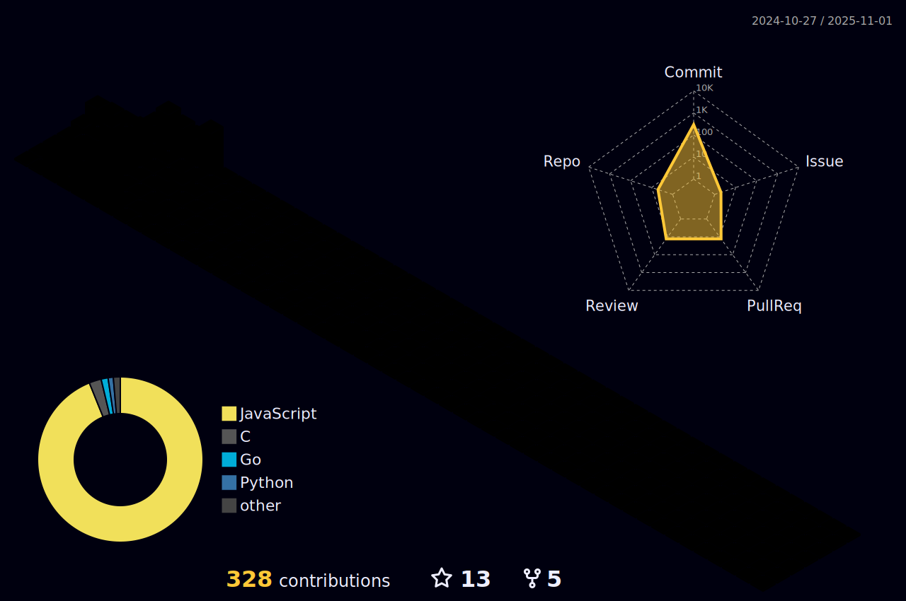

<!-- Cyberpunk cafe Pixel art: https://media.giphy.com/media/pVGsAWjzvXcZW4ZBTE/giphy.gif -->
<!-- Ramen stall pixel art: https://media.giphy.com/media/ckr4W2ppxPBeIF8dx4/giphy.gif -->
<!-- Cyberpunk city pixel art: https://media.giphy.com/media/NKEt9elQ5cR68/giphy.gif -->
<!-- Cowboy bebob: https://media.giphy.com/media/4ilFRqgbzbx4c/giphy.gif -->
<!-- Tales of arise fight scene: https://media.giphy.com/media/6ULDGyRw0uhECEhAaQ/giphy-downsized-large.gif -->

# 👋 Hello, I'm Conrad

# 💭 About Me
- [42Heilbronn](https://www.42heilbronn.de/en/) Student (Part of the [42Network](https://www.42network.org/))
- Programmer
- Gamer
- Anime enjoyer
- Always trying to learn something new

# 📊 Github Stats
<!--  -->
<h4 align="center">Isometric view of contributions in the last year. Language pie is based on recent commits</h4>

	

### ✨ Overview
 
 

### 🏆 GitHub Trophies

# 🔧 Skills:
#### Tech:

#### Tools:

#### Currently Learning:

> Tech: C, JavaScript, TypeScript, Vue, HTML, CSS, TailwindCSS \
> Tools: Github, Git, Stackoverflow, VSCode \
> Currently Learning: C++, Go

## ✉️ Get In Touch
Don't hesitate to reach out to me, whether you have a question, want to hang out, or even play a game – just give me a ping!

  

  

  

  
  

